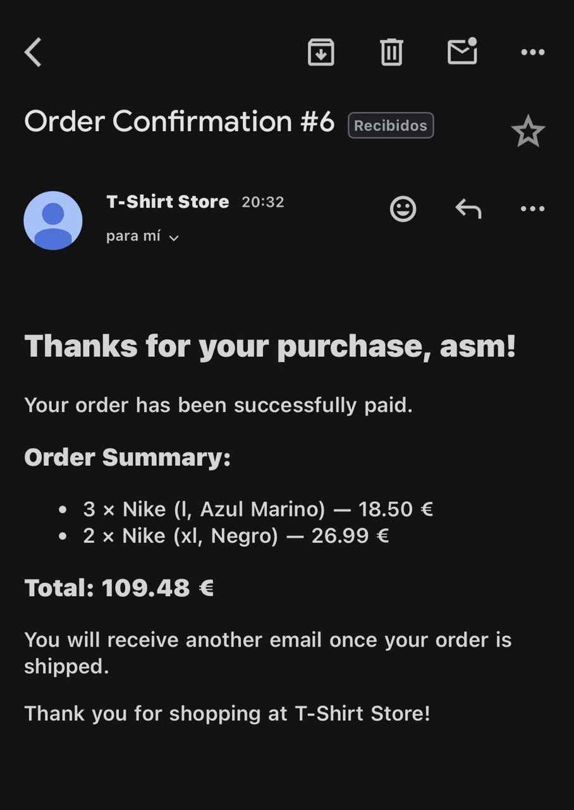

# T-Shirt Store Project — NEPM Stack

A complete web application built using the **NEPM stack** (Node.js, Express, Pug and MySQL) to manage an online T-shirt store.  
The project includes authentication, product management, shopping cart functionality and order administration.


---

## Project Structure

```bash
.
├── README.md
├── config/         # Configuration files (DB, environment, etc.)
├── controllers/    # Route controllers
├── logs/           # Log files
├── middlewares/    # Custom middleware
├── migrations/     # Database migrations
├── models/         # Database models / queries
├── package.json
├── public/         # Static assets
│ ├── css/
│ ├── images/
│ └── js/
├── routes/         # Express route definitions
├── scripts/        # Utility scripts
├── seeders/        # Sample / initial data
├── services/       # Business logic and external services
├── stack/
│ ├── db/
│ │ └── init.sql    # MySQL initialization script
│ └── docker-compose.yml 
├── tests/          # Automated tests
├── utils/          # Utility functions and helpers
└── views/          # Pug templates
  ├── layouts/
  └── partials/
```

---

## Main Features

- **User authentication**
  - Signup and login with hashed passwords (bcrypt)
  - Roles: CLIENT and OPERATOR
  - Session management with cookies

- **Two complete CRUDs**
  - T-shirts (`/admin/camiseta`)
  - Orders (`/admin/pedido`)

- **Master-detail views**
  - Orders with order lines
  - T-shirt details and variants

- **Shopping cart**
  - Add and remove items
  - Checkout and payment simulation

- **Admin panel**
  - Stock and price management
  - Filter orders by status

---

## Git Branching Strategy

Branch structure follows a simplified Git Flow model:
```bash
main
└── dev
    ├── feature/auth-login-signup
    ├── feature/tshirt-crud
    ├── feature/cart
    ├── feature/orders
    ├── feature/admin-panel
    ├── feature/stats
    ├── fix/...
    └── hotfix/...
```

**Branch naming conventions**

- `feature/`: new functionality  
- `fix/`: minor bug fixes  
- `hotfix/`: urgent production fixes  

Merges into `main` are performed only from `dev` after testing.

---

## Technologies

| Technology       | Purpose                          |
|------------------|----------------------------------|
| Node.js          | Backend runtime                  |
| Express          | Web framework                    |
| Pug              | Template engine                  |
| MySQL            | Relational database              |
| Docker Compose   | Environment setup (MySQL + App)  |
| bcrypt           | Password hashing                 |
| express-session  | Session management               |
| dotenv           | Environment variables            |
| morgan / winston | Logging                          |
| nodemon          | Development hot reload           |

---

## Setup and Installation

### 1. Clone the repository
(Commands provided after the README block.)

### 2. Install dependencies
(Commands provided after the README block.)

### 3. Create a `.env` file

Create a `.env` file in the project root with the following variables:
```bash
PORT=3000
DB_HOST=localhost
DB_USER=root
DB_PASSWORD=your_password
DB_NAME=tshirt_store
SESSION_SECRET=super_secret_value
```

### 4. Initialize the database
You can start the DB via Docker or run the SQL initialization script manually.

### 5. Run the application
(Commands provided after the README block.)

---

## Email Confirmation System (How It Works)

The app automatically emails an order confirmation to the customer right after checkout. Follow these steps to enable it locally.

### Configuration Steps
- Email is sent via **Nodemailer** using the transporter in `config/mailer.js`:
```js
const nodemailer = require("nodemailer");

const transporter = nodemailer.createTransport({
    service: "gmail",
    auth: {
        user: process.env.MAIL_USER,
        pass: process.env.MAIL_PASS
    }
});

module.exports = transporter;
```
- Emails are triggered during checkout inside `controllers/cartController.js` → `processBuy()`.

### Gmail App Password Requirement
To use Gmail:
- Enable **Two-Step Verification** in your Google Account.
- Generate an **App Password** at https://myaccount.google.com/apppasswords
  - App → Mail
  - Device → Other (e.g. `tshirt-store`)
- Use the generated password in your `.env`.

### Environment Variables
complete your .env file with the following keys:
```bash
MAIL_USER=your-email@gmail.com
MAIL_PASS=your-app-password-without-spaces
```

### Email Contents
- Customer name
- Order ID
- List of purchased items with quantities, sizes and colors
- Total amount
- Shipping notification message
- Sent automatically once checkout completes



---

## Main Endpoints

| Route                | Method      | Description                     | Role     |
|----------------------|-------------|---------------------------------|----------|
| `/`                  | GET         | Home page                       | Public   |
| `/auth/login`        | GET / POST  | User login                      | Public   |
| `/auth/signup`       | GET / POST  | User registration               | Public   |
| `/auth/logout`       | GET / POST  | Logout                          | Public   |
| `/admin/camiseta`    | CRUD        | Manage t-shirts                 | OPERATOR |
| `/admin/pedido`      | CRUD        | Manage orders                   | OPERATOR |
| `/camiseta`          | GET         | List all t-shirts               | CLIENT   |
| `/camiseta/:id`      | GET         | T-shirt details                 | CLIENT   |
| `/carro`             | GET         | View shopping cart              | CLIENT   |
| `/carro/add`         | POST        | Add product to cart             | CLIENT   |
| `/carro/del`         | POST        | Remove product from cart        | CLIENT   |
| `/pedido`            | GET         | List user orders                | CLIENT   |
| `/pedido/:id`        | GET         | View specific order             | CLIENT   |

---

## Database Schema Overview

### T-shirt
- id  
- size (xxs, xs, s, m, l, xl, xxl)  
- gender (male, female, unisex, child, etc.)  
- color  
- brand  
- stock  
- price  

### User
- id  
- username  
- password (hashed)  
- email  
- phone  
- address  

### Order
- id  
- date  
- status (cart, paid, processing, processed, shipped, received)  
- client  
- total  

### Order Line
- id  
- order_id  
- product_id  
- sale_price  

---

## Architecture Diagram (Logical)

```bash
┌──────────────────────────────────────────┐
│ CLIENT                                   │
│ (Browser / Mobile / Postman / etc.)      │
└──────────────────────────────────────────┘
                    │
                    ▼
        ┌──────────────────────┐
        │ ROUTES               │
        │ (Express Routers)    │
        └──────────────────────┘
                    │
                    ▼
        ┌──────────────────────┐
        │ CONTROLLERS          │
        │ (Handle requests,    │
        │ call services)       │
        └──────────────────────┘
                    │
                    ▼
        ┌──────────────────────┐
        │ SERVICES             │
        │ (Business logic)     │
        └──────────────────────┘
                    │
                    ▼
        ┌──────────────────────┐
        │ MODELS               │
        │ (DB queries / ORM)   │
        └──────────────────────┘
                    │
                    ▼
        ┌──────────────────────┐
        │ MySQL DB             │
        └──────────────────────┘
```


**Notes**
- Routes handle HTTP requests and delegate to controllers.  
- Controllers prepare data and call services.  
- Services contain business logic (calculating totals, stock checks).  
- Models perform DB operations (using `mysql2` or ORM).  
- Views (Pug) render UI for client-facing pages.  
- Middlewares handle authentication, logging, validation, etc.

---

## Contributing

- Create a feature branch from `dev`: `feature/your-feature-name`.  
- Make atomic commits with clear messages.  
- Open a Merge Request (MR) to `dev`.  
- After review and tests, `dev` is merged into `main` for releases.

---


## Testing

Place tests under `tests/`. Prefer structure like `tests/unit` and `tests/integration`. Use a test runner such as Jest or Mocha/Chai.

---


Bash commands (copy these manually into your terminal when needed):

```bash
git clone https://github.com/ADelgadoMontoro/tshirt-store-nepm-stack.git
cd tshirt-store
npm install
cd stack
docker-compose up -d
```
