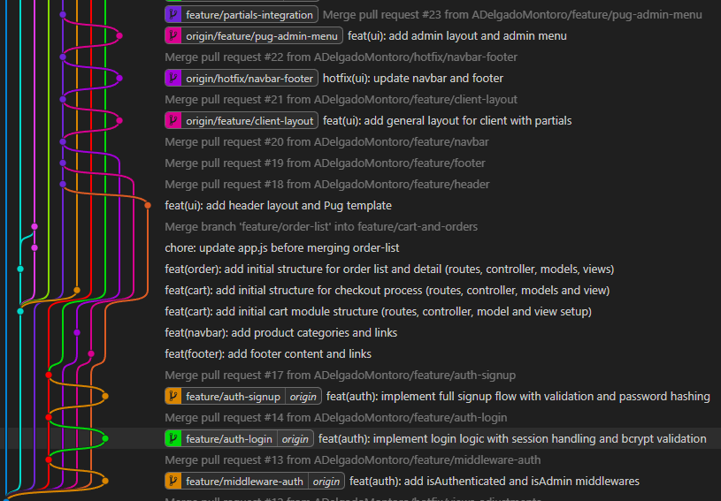
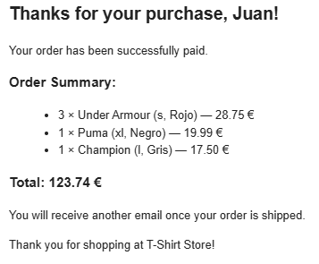
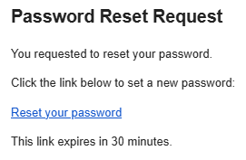

   # ByteZone PC Store (NEPM Stack)

   
   
   
   
   
   
   
   
   
   

   A web app for a PC components store built with Node.js, Express, Pug, and MySQL. The catalog focuses on RAM, SSDs, processors, graphics cards, cases, cooling, power supplies and peripherals.
   This project was developed for educational purposes, as a regular class assignment, focused on applying backend development fundamentals, database integration, middleware usage, and collaborative workflows.

   ## How we worked
   - **Branches**: simple flow with `dev` + `feature/*` / `fix/*`; merge into `dev`, then into `main` after review.
   - **Process**: short iterations with a lightweight board on clickup.com for tasks and bugs.

   ## Branches
   

   ## Prerequisites
   - Node.js (LTS)
   - Docker & Docker Compose (for the database)

   ## Environment setup
   The backend reads variables from `stack-bytezone/.env`. Start from the example and adjust:

   ```bash
   cp stack-bytezone/.env.example stack-bytezone/.env
   ```

   Minimum values that must be set in `stack-bytezone/.env`:
   ```bash
   PORT=3000                 # app port
   MYSQL_HOST=localhost
   MYSQL_HOST_PORT=3306      # host port for MySQL
   MYSQL_USERNAME=root
   MYSQL_ROOT_PASSWORD=change_this_secure_password
   MYSQL_DATABASE=bytezone   # matches init.sql

   # Docker port mappings (tweak if needed)
   MYSQL_CONTAINER_PORT=3306
   ADMINER_CONTAINER_PORT=8080
   ADMINER_HOST_PORT=8080

   # Email (services/emailService.js)
   MAIL_USER=your_email@gmail.com
   MAIL_PASS=your_app_password
   ```

   For Gmail, use an app password (2FA enabled). Email is used for password reset and order confirmations.

   ### How to get a Gmail App Password
   1) Enable 2-Step Verification on your Google account.  
   2) Go to https://myaccount.google.com/apppasswords  
   3) Choose app: Mail; device: Other (e.g. `bytezone-store`) and generate.  
   4) Copy the 16-character password and set `MAIL_PASS` to that value.

   ## Run the project
   ```bash
   git clone https://github.com/ADelgadoMontoro/bytezone-pc-store.git
   cd ByteZone
   npm install

   # Start MySQL + Adminer with seed data
   cd stack-bytezone
   docker-compose up -d
   cd ..

   # Run the app
   npm start
   # dev mode (watch)
   npm run dev
   ```

   The database seeds from `stack-bytezone/db/init.sql` when the container starts.

   ## Test accounts
   - Admin: `admin@admin.com` / `admin` (role OPERATOR)
   - User: `user@user.com` / `user` (role CLIENT)

   Use them to validate admin screens, checkout, and auth flows.

   ## Middleware
   This project includes a dedicated **middleware layer** that intercepts incoming HTTP requests before they reach the controllers.

   Its main responsibilities are:
   - Validating that a user session exists.
   - Enforcing **role-based access control** (CLIENT / OPERATOR).
   - Protecting sensitive routes such as admin panels and restricted actions.

   By centralizing these checks in middleware, the application ensures consistent security rules, cleaner controllers, and easier maintenance.


   ## Highlights
   - Session-based auth with roles (CLIENT / OPERATOR).
   - Admin panel: manage products and users, with dashboard navigation.
   - Public catalog and product detail.
   - Cart with totals and stock updates; order confirmation email on payment.
   - Password recovery via email token.

   ## Email examples
   - Purchase confirmation email:

   
   - Forgot-password email:

   

   ## Database schema (overview)
   ```
   user (id, username, email, phone, address, active, role, created_at, updated_at)
   password (id, user_id, password_hash, created_at, is_active)
   product (id, category, specs, brand, stock, price, active, image)
   customer_order (id, date, status, client, total)
   customer_order_line (id, customer_order, product, sale_price, quantity)
   payment_method (id, user_id, card_type, last_four, expiry_month, expiry_year, is_default, token)
   payment (id, customer_order_id, payment_method_id, amount, status, transaction_id, payment_date, created_at)
   reset_tokens (user_id, token, expires_at)
   ```

   ## Mailing approach
   We consolidated on a single email service (`services/emailService.js`) to keep credentials and transport config in one place. It cut duplicate SMTP configs, removed inconsistencies between auth and checkout flows, and simplifies rotating keys or swapping providers later.

   ## Request Flow and Architecture

   Since the application is built with **Node.js and Express**, each feature follows a clear and structured flow:

   1. **Router**
      - Defines the application routes and the HTTP methods (`GET`, `POST`, etc.).
      - Connects each route to the appropriate middleware and controller.

   2. **Middleware**
      - Intercepts incoming requests before they reach the controller.
      - Handles cross-cutting concerns such as authentication, authorization, and session validation.

   3. **Controller**
      - Contains the business logic for each route.
      - Processes the request, interacts with services or the database, and prepares the response data.

   4. **View (Pug)**
      - Renders the final HTML sent to the client.
      - Receives data from the controller and displays it to the user.

   This separation of responsibilities improves code readability, maintainability, and scalability, and reflects a simplified **MVC-based architecture** commonly used in Node.js applications.


   ## Structure
   ```
   config/         # DB and session config
   controllers/    # Route logic
   middlewares/    # Auth and role checks
   routes/         # Express routers
   services/       # Email, etc.
   views/          # Pug templates (layouts, partials, admin/client views)
   public/         # Static assets (CSS/JS)
   stack-bytezone/  # MySQL infra + seed + .env
   ```

   ## Notes
   - All admin routes are protected with `isAdmin`.
   - Header category links go to the product list at `/products`.
   - If you change ports or creds in `.env`, keep them in sync with `config/database.js`.
